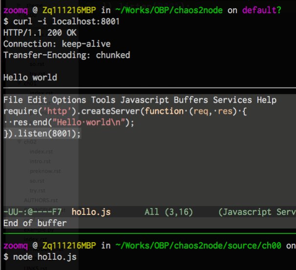

.. include:: ../LINKS.rst

+10分钟:初尝
==============

整起来先!
- 嗯嗯嗯,现在可以计时了: `00:00`

安装
--------

`参考:` `官方安装说明 <https://github.com/joyent/node/wiki/Installing-Node.js-via-package-manager>`_

.. sidebar:: 提示

    - 不专门说明的话,指的都是笔者的个人环境:

      - MAC OS X 10.7.3
      - brew 0.8.1
      - node 0.6.12
      - coffeescript 1.2.0

走起 ::

    $ brew install node
    ...
    node 0.6.12
    http://nodejs.org/
    /usr/local/Cellar/node/0.6.11 (80 files, 7.6M)
    /usr/local/Cellar/node/0.6.12 (80 files, 7.6M) *

    Homebrew has NOT installed npm. We recommend the following method of
    installation:
      curl http://npmjs.org/install.sh | sh

    After installing, add the following path to your NODE_PATH environment
    variable to have npm libraries picked up:
      /usr/local/lib/node_modules

    http://github.com/mxcl/homebrew/commits/master/Library/Formula/node.rb
    
    $ curl http://npmjs.org/install.sh | sh
    ...
    $ npm search coffee
    $ npm se coffee
    ...
    DESCRIPTION                                                   AUTHOR                DATE              KE
    ...
    CoffeeScript               =omarkhan             2012-03-12 00:49  do

    $ sudo npm install CoffeeScript -g
    ...
    $ npm list
    /Users/zoomq
    (empty)
    $ npm list -g
    /usr/local/lib
    ├── coffee-script@1.2.0 
    └─┬ npm@1.1.1 
      ├── abbrev@1.0.3 
      ├─┬ block-stream@0.0.5 
      │ └── inherits@1.0.0 
      ├── fast-list@1.0.2 
      ├── fstream@0.1.12 
      ├── graceful-fs@1.1.5 
      ├── inherits@1.0.0 
      ├── ini@1.0.2 
      ├── lru-cache@1.0.5 
      ├── minimatch@0.1.5 
      ├── mkdirp@0.3.0 
      ├── node-uuid@1.3.3 
      ├── nopt@1.0.10 
      ├── proto-list@1.0.0 
      ├── read@0.0.1 
      ├── request@2.9.100 
      ├── rimraf@2.0.1 
      ├── semver@1.0.13 
      ├── slide@1.1.3 
      ├─┬ tar@0.1.12 
      │ └─┬ block-stream@0.0.5 
      │   └── inherits@1.0.0 
      └── which@1.0.3 

.. note:: (~_~)

  - npm 是 `node.js`_ 世界的包管理平台,一定要使用! 否则,,,
  - 一定要使用 `sudo npm install *** -g` 全局模块安装,否则,,,
  - 不到万不得以,尽量使用 官方的 npm 仓库,否则,,,

嗨!
--------

著名的 `hello world <http://baike.baidu.com/view/47227.htm>`_ 是一定要整的,,,

.. code-block:: js
    
    var http = require('http');
     
    var server = http.createServer(function (req, res) {
      res.writeHead(200, { "Content-Type": "text/plain" })
      res.end("Hello world\n");
    });
     
    server.listen(process.env.PORT || 8001);

3句话,建立并发布了一个守护 `:8001` 端口的网站,
当然,可以使用一行就完成同样的功能:

.. code-block:: js

    require('http').createServer(function (req, res) {
      res.end('Hello World\n');
      }).listen(8001);

运行和测试如 :ref:`fig_1_1`

.. _fig_1_1:

   插图.1-1 运行hollo.js

可以在任何目录中,随时调用 `node 自个儿的.js` 来运行 `node.js`_ 应用;-)

初解
----------

.. code-block:: js
    
    // 加载内置模块 http
    var http = require('http');
    // 创建服务,并声明匿名函式来完成服务器的日常工作
    var server = http.createServer(function (req, res) {
      // 对所有请求返回标准 http 头响应 200 以及内容格式
      res.writeHead(200, { "Content-Type": "text/plain" })
      // 内容就是 "Hello world\n" 
      res.end("Hello world\n");
    });
    // 服务侦听端口 8001
    server.listen(process.env.PORT || 8001);

那么接下来怎么整?

小结
------

不出意外的话, `10:00` 用在这个阶段,太足够了!

应该已经体验到  `node.js`_ 的核心爽直了?!

- 只要具备 JavaScipty 的编程经验,就可以进行服务端的开发了!
- 而且, 性能在 **`V8`_** 引擎的强力支持下一点也不差!

