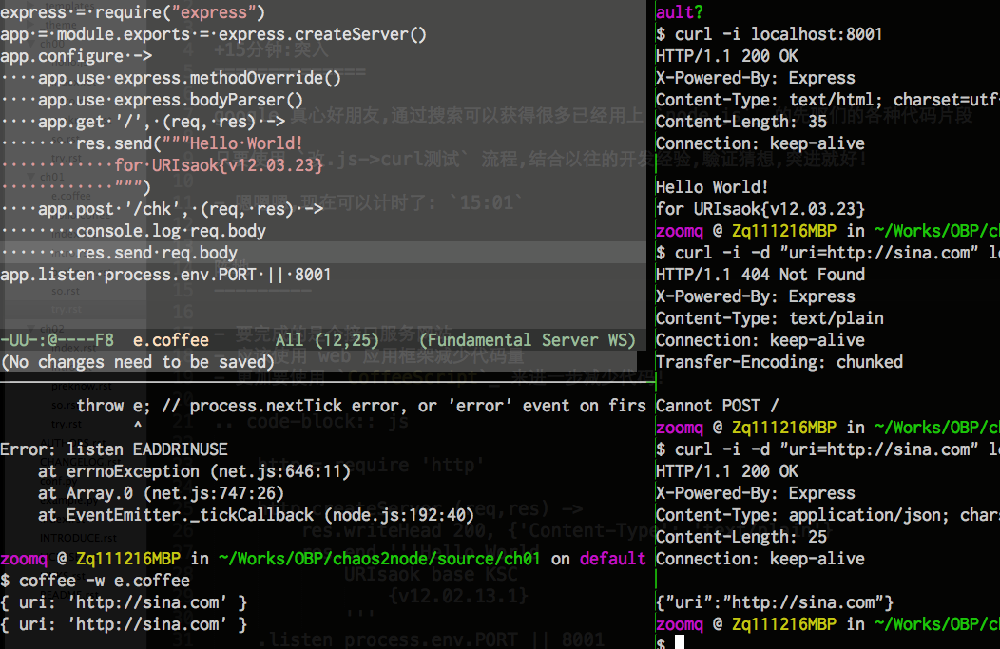
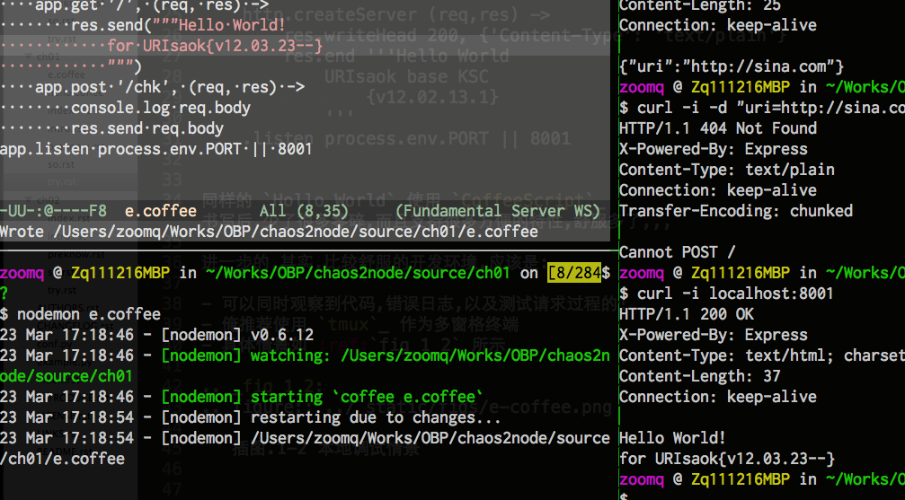
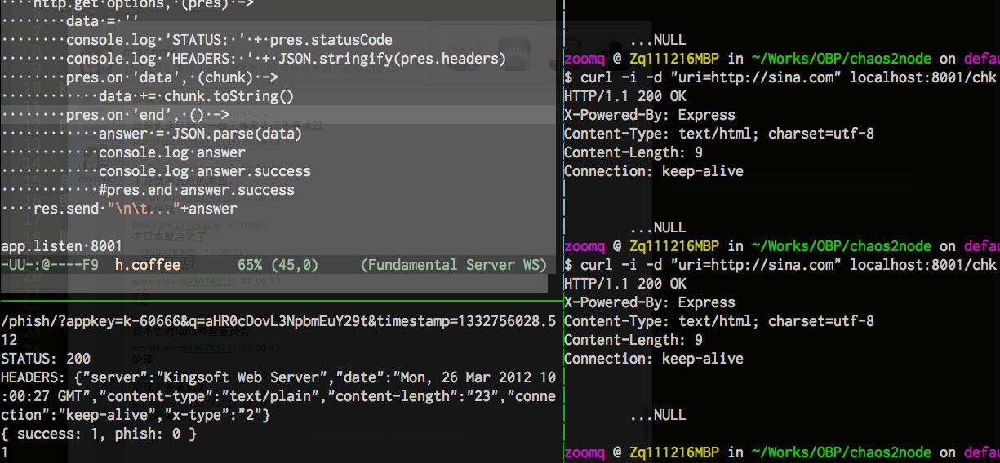

.. include:: ../LINKS.rst

+20分钟:突入node.js 
============================

google 真心好朋友,通过搜索可以获得很多已经用上 `node.js`_ 的先驱们的各种代码片段

只要使用 `改.js->curl测试` 流程,结合以往的开发经验,驗证猜想,突进就好!

- 嗯嗯嗯,现在可以计时了: `15:01`

阵地
---------

- 要完成的是个接口服务网站
- 应该使用 web 应用框架减少代码量
- 更加要使用 `CoffeeScript`_ 来进一步减少代码!

.. code-block:: js

    http = require 'http'

    http.createServer (req,res) -> 
        res.writeHead 200, {'Content-Type': 'text/plain'}
        res.end '''Hello World
            URIsaok base KSC
                {v12.02.13.1}
            '''
    .listen process.env.PORT || 8001

同样的 `Hollo World` 使用 `CoffeeScript`_  书写后,少了很多零碎,而且支持很多方便的特性,舒服多了,,,

.. code-block:: js
    
    // 使用 express 框架,快速建立应用阵地
    express = require("express")
    app = module.exports = express.createServer()
    app.configure ->
        app.use express.methodOverride()
        app.use express.bodyParser()
        // 以上都是基本配置,照抄就好
        app.get '/', (req, res) ->
            // 捕获 GET 请求
            res.send("""Hello World!
                for URIsaok{v12.03.23--}
                """)
        app.post '/chk', (req, res) ->
            // 捕获 POST 请求
            console.log req.body
            res.send req.body
    app.listen process.env.PORT || 8001

进一步的,其实,比较舒服的开发环境,应该是:

- 可以同时观察到代码,错误日志,以及测试请求过程的!
- 俺推荐使用 `tmux`_ 作为多窗格终端
- 具体情景如 :ref:`fig_1_2` 所示

.. _fig_1_2:

   插图.1-2 本地调试情景

    - 左上是脚本编辑
    - 左下是脚本运行
    - 右方是 curl 请求测试区

但是!每当修订了代码后,都要重启应用,以便加载到内存中,这就很不人道了!
- 所以,快速安装 `remy/nodemon <https://github.com/remy/nodemon>`_

::

    $ sudo npm install nodemon -g
    $ npm list -g
    # 观察是否正常安装了 nodemon

- 然后就可以真正专注 修订和测试,不用管应用的重启了,,,
- 具体情景如 :ref:`fig_1_3`

.. _fig_1_3:

   插图.1-3 用nodemon 自动重启

`可以看到,每当代码发生改变时,nodemon 就自动尝试重启;-)`

搞掂
---------

好的,什么都整顿舒服了,就可以快速一条条试错的方式,堆出所有业务逻辑了!

.. code-block:: js

    express = require("express")
    app = module.exports = express.createServer()
    app.configure ->
        app.use express.bodyParser()
        app.use express.methodOverride()
        app.use app.router
    app.configure "production", ->
        app.use express.errorHandler()
    // 以上都是八股式标准配置
    app.get "/", (req, res) ->
        res.send "URIsaok{v12.03.23}"

    crypto = require('crypto') // 加载内置加密模块
    APPKEY = "k-60666"
    SECRET = "99fc9fdbc6761f7d898ad25762407373"
    ASKTYPE = "/phish/?"
    // 金山网址安全云相关接口参数
    checkForValidUrl = (uri) ->
        crtURI = Buffer(uri).toString('base64')
        timestamp = Date.parse(new Date())/1000+".512"
        signbase = ASKTYPE+"appkey="+APPKEY+"&q="+crtURI+"&timestamp="+ timestamp
        sign = crypto.createHash('md5').update(signbase+SECRET).digest("hex")
        signbase+"&sign="+sign
        // 高效完成查询字串的准备
    http = require('http')  // 混合使用内置 http 模块进行外部请求
    app.post '/chk', (req, res) ->
        askurl = checkForValidUrl(req.body.uri)
        answer = 'NULL'
        options = 
            host: 'open.pc120.com'
            port: 80
            path: askurl
        http.get options, (pres) ->
            data = ''
            console.log 'STATUS: ' + pres.statusCode
            console.log 'HEADERS: ' + JSON.stringify(pres.headers)
            pres.on 'data', (chunk) ->
                data += chunk.toString()
            pres.on 'end', () ->
                answer = JSON.parse(data)
                console.log answer
                console.log answer.success
        res.send "\n\t..."+answer

    app.listen 8001

`node.js`_ 真心 `碉堡` 了! 所有最常见的操作都内置了!

- 字串的 `base64` 编码: `Buffer(uri).toString('base64')`
- 字串的 `md5` 编码: `crypto.createHash('md5').update(字串).digest("hex")`
- 当前时间戮只能先模拟小数点后的: `Date.parse(new Date())/1000+".512"`
- `POST` 上来的数据体 `req.body.uri`
- 实际数据的引用: `req.body.uri`
- JSON数据体的解析: `JSON.parse`

但是,怎么 `向外部url发出请求并接收数据?!`

- `简单问题: http.get() 如何同步返回給客户端? - CNode <http://club.cnodejs.org/topic/4f3b7ebdb43c3c846a062332>`_

测试输出如 :ref:`fig_1_4`

.. _fig_1_4:

   插图.1-4 http.get()的异步问题

fetch
^^^^^^^^^^^^^^^^^

- 增补到工作脚本中

.. code-block:: lua

    --前略,,,
    local chkURI = checkForValidUrl(url)
    --ngx.say(chkURI)
    ok, html = _fetch_uri(chkURI)
    ngx.say("_fetch_uri:\t", ok, "\t", html)

- 测试,确认效果: ::

    ...
    http://open.pc120.com/phish/?appkey=k-60666&q=aHR0cDovL3NpbmEuY29t&timestamp=1331306157.315&sign=4190815f3920d9bbd0d1410525343a0e
    _fetch_uri:     true    {"success":1,"phish":0}

基本功能,达成, `收功!`

.. warning:: (#_#)

    - 这里涉及 node 的异步I/O模型的理解和使用
    - 暂时可以使用以往的经验,配合相关的模块解决
    - 但是,实在应该找机会深入学习理解一下,,,
    

小结
---------

`30:07` ~ 这一堆,二十分鈡,整出来不难吧?

想来:
- 其实,关键功能性行为代码,就8行

    - 其中7 行全部可以在google 中直接搜索到
    - 仅仅有一行,是需要学习新的工具,安装新的组件,学习新的文档,抄进来新的函式
    - 即: `ok, html = _fetch_uri(chkURI)`

- 其余,都是力气活儿

    - 只要别抄錯
    - 都是赋值,赋值,赋值,赋值,,,,

- 只要注意每一步,都使用 `ngx.say()` 吼回来,测试确认无误,就可以继续前进了,,,

`这就是脚本语言的直觉式开发调试体验!`

