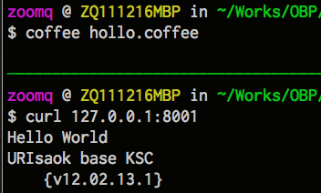

.. include:: ../LINKS.rst

+20分钟:突入 CoffeeScript 
============================

google 真心好朋友,通过搜索可以获得很多已经用上 `node.js`_ 的先驱们的各种代码片段

只要使用 `改.js->curl测试` 流程,结合以往的开发经验,驗证猜想,突进就好!

- 嗯嗯嗯,现在可以计时了: `15:01`

07:05~ 确认阵地
------------------------------------

- 要完成的是个接口服务网站
- 应该使用 web 应用框架减少代码量
- 更加要使用 `CoffeeScript`_ 来进一步减少代码!

.. literalinclude:: hollo.coffee
    :language: js

同样的 `Hollo World` 使用 `CoffeeScript`_  书写后,少了很多零碎,而且支持很多方便的特性,舒服多了,,,

- 具体情景如 :ref:`fig_1_1` 所示

.. _fig_1_1:

   插图.1-1 运行 `CoffeeScript` 改写的情景

进一步的,其实,比较舒服的开发环境,应该是:

- 可以同时观察到代码,错误日志,以及测试请求过程的!
- 俺推荐使用 `tmux`_ 作为多窗格终端
- 具体情景如 :ref:`fig_1_2` 所示

.. _fig_1_2:
.. figure:: ../_static/figs/e-coffee.png

   插图.1-2 本地调试情景

    - 左上是脚本编辑
    - 左下是脚本运行
    - 右方是 curl 请求测试区

但是!每当修订了代码后,都要重启应用,以便加载到内存中,这就很不人道了!
- 所以,快速安装 `remy/nodemon <https://github.com/remy/nodemon>`_

::

    $ sudo npm install nodemon -g
    $ npm list -g
    # 观察是否正常安装了 nodemon

- 然后就可以真正专注 修订和测试,不用管应用的重启了,,,
- 具体情景如 :ref:`fig_1_3`

.. _fig_1_3:
.. figure:: ../_static/figs/nodemon-coffee.png

   插图.1-3 用nodemon 自动重启

`可以看到,每当代码发生改变时,nodemon 就自动尝试重启;-)`

囧过程: 框架选择
---------------------------

什么是框架呢? 简单的摆和就是:

- 框架是给人使用的,相比库,是给程序使用的,,,
- 框架包含了领域经验,针对领域的常见问题,进行了友好的封装,得以用简洁的代码完成同样的功能
- 框架包含的经验,封装成了固化的解决思路,如果和我们的问题域对不上,那将是非常的麻烦,不得不深入框架的代码进行各种 `Hacking` 了,到那时,也就丧失了 框架的加速问题解决的本质功能了,,,
- 这时,果然换之!

在解决: 包装 `金山网址云安全开放API <http://code.ijinshan.com/api/devmore4.html#md1>`_ 为接口服务

- 这一问题之时
- 笔者就是不信邪尝试了一批 `CoffeeScript`_ web 应用框架
- 結果...

`Zappa <https://github.com/mauricemach/zappa>`_
^^^^^^^^^^^^^^^^^^^^^^^^^^^^^^^^^^^^^^^^^^^^^^^^^^^^^^^^^^^^

号称给懒人使用的框架,开始很美:

.. literalinclude:: z.coffee
    :language: js

哗! 比 `CoffeeScript`_ 更加简洁,完成相同的路由声明,以及默认返回信息吼,,,

- 可是!
- 文档真心简洁!
- 什么获得 POST 的数据?
- 怎么进行调试的日志输出?
- 什么也找不到,,,

`Express`_
^^^^^^^^^^^^^^^^^^^^^^^^^^^^^^^^^^^^^^^^^^^^^^^^^^^^^^^^^^^^

`Express`_ 可以説是目前 `node.js`_ 框架中的 `一哥` ! 功能多/稳定/高效!

- 不过,是纯 `node.js`_ 的
- 暂时还没有 `CoffeeScript`_ 的版本
- 根据 `文档中的相关片段 <http://expressjs.com/guide.html#routing>`_

.. code-block:: js

    var express = require('express')
      , app = express.createServer();

    app.use(express.bodyParser());

    app.post('/', function(req, res){
      res.send(req.body);
    });

    app.listen(3000);

手工改写成 `CoffeeScript`_ 格式,感觉,还算自然:

.. code-block:: js
    
    // 使用 express 框架,快速建立应用阵地
    express = require("express")
    app = module.exports = express.createServer()
    app.configure ->
        app.use express.methodOverride()
        app.use express.bodyParser()
        // 以上都是基本配置,照抄就好
        app.get '/', (req, res) ->
            // 捕获 GET 请求
            res.send("""Hello World!
                for URIsaok{v12.03.23--}
                """)
        app.post '/chk', (req, res) ->
            // 捕获 POST 请求
            console.log req.body
            res.send req.body
    app.listen process.env.PORT || 8001

- 解决了 POST 数据获取
- 路由当然也很自在
- 问题是死活没有找到怎么在 `Express`_ 中进行对外部网站请求,并接受数据的方式!!!

HTTP 内置模块
^^^^^^^^^^^^^^^^^^^^^^^^^^^^^^^^^^^^^^^^^^^^^^^^^^^^^^^^^^^^

只有认真沉下心来挖掘官方文档,果然!

- `HTTP <http://nodejs.org/api/http.html#http_http_get_options_callback>`_ 内置模块中有
- `http.get(options, callback)` 专用函式

.. code-block:: js

    var options = {
      host: 'www.google.com',
      port: 80,
      path: '/index.html'
    };

    http.get(options, function(res) {
      console.log("Got response: " + res.statusCode);
    }).on('error', function(e) {
      console.log("Got error: " + e.message);
    });

依然手工改写为对应的 `CoffeeScript`_ 形式,的确可用!

所以呢:
    - 模块/包,现在 `node.js`_ 真心非常丰富了!
    - 但是品质并不都是 NB 的
    - 选择一定要以解决自身问题为基础,不能光求新鮮
    - 而且一定要关注作者是否勤奋,否则,下个 `node.js`_ 版本就不兼容了,要死人的,,,
    - 所以呢,俺现在习惯对模块的选择,综合以下要点:

        #. 文档是否规范
        #. 修订是否积极
        #. 分支是否多

搞掂?!
------------------

好的,什么都整顿舒服了,就可以快速一条条试错的方式,堆出所有业务逻辑了!

.. code-block:: js

    express = require("express")
    app = module.exports = express.createServer()
    app.configure ->
        app.use express.bodyParser()
        app.use express.methodOverride()
        app.use app.router
    app.configure "production", ->
        app.use express.errorHandler()
    // 以上都是八股式标准配置
    app.get "/", (req, res) ->
        res.send "URIsaok{v12.03.23}"

    crypto = require('crypto') // 加载内置加密模块
    APPKEY = "k-60666"
    SECRET = "99fc9fdbc6761f7d898ad25762407373"
    ASKTYPE = "/phish/?"
    // 金山网址安全云相关接口参数
    checkForValidUrl = (uri) ->
        crtURI = Buffer(uri).toString('base64')
        timestamp = Date.parse(new Date())/1000+".512"
        signbase = ASKTYPE+"appkey="+APPKEY+"&q="+crtURI+"&timestamp="+ timestamp
        sign = crypto.createHash('md5').update(signbase+SECRET).digest("hex")
        signbase+"&sign="+sign
        // 高效完成查询字串的准备
    http = require('http')  // 混合使用内置 http 模块进行外部请求
    app.post '/chk', (req, res) ->
        askurl = checkForValidUrl(req.body.uri)
        answer = 'NULL'
        options = 
            host: 'open.pc120.com'
            port: 80
            path: askurl
        http.get options, (pres) ->
            data = ''
            console.log 'STATUS: ' + pres.statusCode
            console.log 'HEADERS: ' + JSON.stringify(pres.headers)
            pres.on 'data', (chunk) ->
                data += chunk.toString()
            pres.on 'end', () ->
                answer = JSON.parse(data)
                console.log answer
                console.log answer.success
        res.send "\n\t..."+answer

    app.listen 8001

`node.js`_ 真心 `碉堡` 了! 所有最常见的操作都内置了!

- 字串的 `base64` 编码: `Buffer(uri).toString('base64')`
- 字串的 `md5` 编码: `crypto.createHash('md5').update(字串).digest("hex")`
- 当前时间戮只能先模拟小数点后的: `Date.parse(new Date())/1000+".512"`
- `POST` 上来的数据体 `req.body.uri`
- 实际数据的引用: `req.body.uri`
- JSON数据体的解析: `JSON.parse`

但是,怎么 `向外部url发出请求并接收数据?!`

- 之前选择框架时,已经可以使用 `http.get()` 获取外部数据了
- 问题是:

    - `简单问题: http.get() 如何同步返回給客户端? - CNode <http://club.cnodejs.org/topic/4f3b7ebdb43c3c846a062332>`_
    - `node.js`_ 是天生异步的!
    - 对外网的请求也是! 所以,发出请求后,就自然返回了
    - 数据接收完备后,才继续处理
    - 可素! 此时,客户的本次请求已经返回了! 没有可用的 i/o 句柄返回远端数据了吼!!!

测试输出如 :ref:`fig_1_4`

.. _fig_1_4:
.. figure:: ../_static/figs/http-get.png

   插图.1-4 http.get()的异步问题

fetch
^^^^^^^^^^^^^^^^^

一搜索才知道, `npm`_ 包中,最多的一种包,就是将 `node.js`_ 的异步行为,封装成同步形式的各种包裹式模块!

- `andris9/fetch <https://github.com/andris9/fetch>`_
- 功能单一,形式简洁,文档规范
- 就是它了!增补到工作脚本中

整个儿的:

.. literalinclude:: app.coffee
    :language: py

- 测试,确认效果
- 基本功能,达成, `收功!`

.. warning:: (#_#)

    - 这里涉及 node 的异步I/O模型的理解和使用
    - 暂时可以使用以往的经验,配合相关的模块解决
    - 但是,实在应该找机会深入学习理解一下,,,
    

37:15 ~ 小结
---------------------------

~ 这一堆,二十分鈡,整出来不难吧?

想来:
- 其实,关键功能性行为代码,就8行

    - 其中7 行全部可以在google 中直接搜索到
    - 仅仅有一行,是需要学习新的工具,安装新的组件,学习新的文档,抄进来新的函式

- 其余,都是力气活儿

    - 只要别抄錯
    - 都是赋值,赋值,赋值,赋值,,,,

- 只要注意每一步,都使用 `console.log` 吼回来,测试确认无误,就可以继续前进了,,,

`这就是脚本语言的直觉式开发调试体验!`

