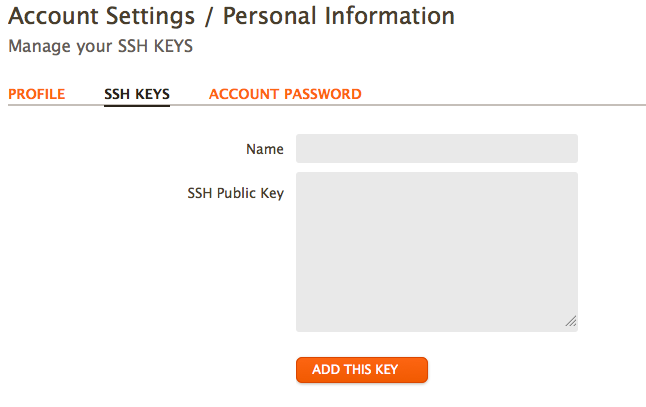
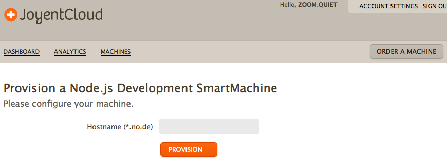
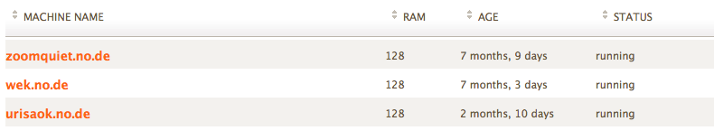
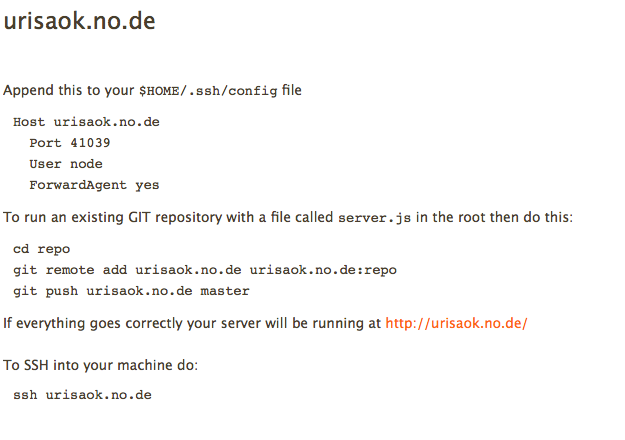
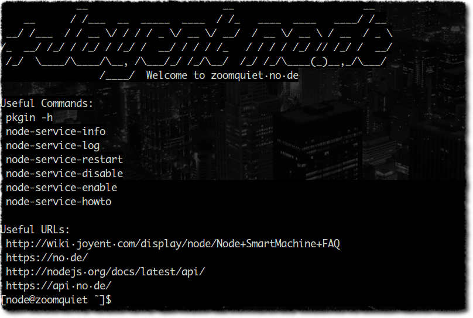

.. include:: ../LINKS.rst

+15分钟:整上 no.de
=====================

宏观步骤

#. 注册 `no.de`_ 帐号,申請主机
#. 等待虚拟主机完成构建
#. 登录,部署 `SSH`_ 公匙
#. `SSH`_ 到主机,通过 `npm`_ 安装必要组件
#. 通过 `git`_ 建立本地工作复本,纳入应用代码, ``push`` 到 `no.de`_ 主机

刨除等待 `Joyent`_ 自动构建的时间,整个应用部署绝对应该在 1020秒之内完成!

开始计时:

37:17 环境准备
-------------------------------------------------------

注册神马的,俺就不用教了吧...

严正提醒参考官方文档:  `Getting Started with a Node.js Development SmartMachine - Node - Joyent Customer Wiki <http://wiki.joyent.com/display/node/Getting+Started+with+a+Node.js+Development+SmartMachine>`_

- 跟着走下来,绝对没有问题!

申請主机
-----------

- 先通过帐号登录进入 `no.de`
- 首先要追加 `SSH`_ 密匙对中的公钥
- 具体情景如 :ref:`fig_1_1` 所示

.. _fig_2_1:

   插图.2-1 提交本地主机的 `SSH`_ 公钥

然后, 申报主机:

.. _fig_2_2:

   插图.2-2 申请的 SmartMachine 通过后的主机信息

倒霉的话,可能需要等待个小半天:

.. _fig_2_3:

   插图.2-3 申请通过后的主机列表

点击进入具体的主机,就能看到具体的操作提示:

.. _fig_2_4:

   插图.2-4 申请的 SmartMachine 通过后的主机信息

然后,就可以进入主机了!

.. _fig_2_5:

   插图.2-5 通过 `SSH`_ 访问时的服务端信息

多漂亮的 字符艺术 图形吼!

- 而且注意到,使用的是 `Solaris`_ 操作系统
- 这可是小型机使用的高端操作系统吼!

部署工具
-----------

使用 `npm list -g` 可以观察到初始情景中,系统安装有什么模块

- 当然的缺少一系列,自个儿写的应用所依赖的
- 不二话, 一通 `npm install` 就搞掂了!

.. note:: (~_~)

    甚至于,可以将 `no.de`_ 当成完整意义上的 虚拟主机,安装你想安装的任何软件!

    - 当然,不能滥用,毕竟是免費主机,配置的资源很少的
    - 跑满了资源,是要付 美刀的了!

部署代码
-----------

正如官方文档中吼的

- 通过 `git`_ 的自然代码 `push` 行为,完成自动的代码部署!
- 如果代码有问题, `no.de`_ 能直接通过 `git`_ 的返回信息打印到本地所有主机的错误信息!

而且,正如登录界面中的提示 `no.de` 提供了一系列实用工具,可以通过命令行完备的观察服务运行情况!

::

    Useful Commands:
     pkgin -h
     node-service-info
     node-service-log
     node-service-restart
     node-service-disable
     node-service-enable
     node-service-howto

- 根据名字就知道是管什么的了,,,

唯一的技巧是要通过 `package.json` 配置声明好包依赖

- 以及 `"scripts": { "start": "coffee app.coffee" }` 这节的配置,令 `no.de` 以 `CoffeeScript`_ 来运行服务!

.. code-block:: json

    {   
        "name": "urisaok.no.de"
        ,"version": "12.2.16"
        ,"author": "Zoom.Quiet <zoomquiet+node@gamil.com>"
        ,"description": "fun KSC with no.de from Joyent..."
        ,"keywords": ["express"
            , "coffee-script"
            , "joyent"
            , "ksc"
            , "rest"
            , "restful"
            ]
        ,"repository": "git://github.com/ZoomQuiet/urisaok.git"
        ,"dependencies": { 
            "coffee-script": "1.2.0" 
            , "express": "2.5.8"
            , "mongoskin ": "0.3.0"
            }
        ,"scripts": { "start": "coffee app.coffee" }
    }

日常调试
----------------------

因为 `no.de`_ 的虚拟机本质 ,可以视为同本地没有任何差异

- 所以,开发调试时,基本不用考虑 `no.de`_ 的环境差异
- 在本地調整好后,部署就得一新版本应用!

整个儿的调试生命周期

::

      coffee 运行起本地应用
        `->修订代码
            ^ `-> cURL 测试
            |           | \
            +-----------/  `+-> git push 部署

**BINGO!**

42:01 小结
---------------------------------

~ 整个部署过程,基本是和 `no.de`_ 环境在沟通,代码?纯粹是复制/粘贴,

- 唯一的新操作就是 `git`_ 的一系列基础操作
- 以及 `SSH`_ 的远程登录,进行 `npm`_ 的安装

15分鈡,整出来不难吧?

.. _fig_2_6:
.. figure:: ../_static/figs/tmux-working.png

   插图.2-6 运行 再次强调 `tmux`_ 支持下的综合开发环境

